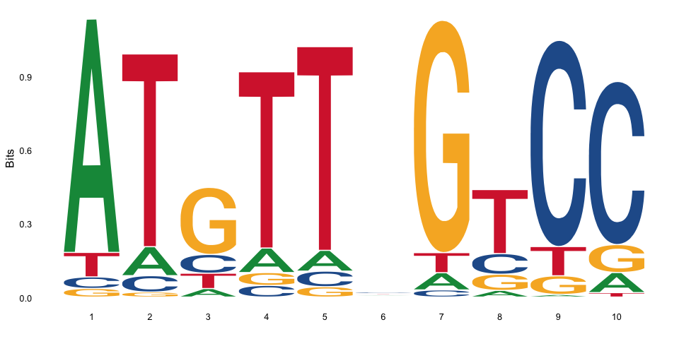

# MotifFinder: Find enriched motifs in a set of DNA sequences
[](https://travis-ci.org/MyersGroup/MotifFinder)
[](https://codecov.io/gh/MyersGroup/MotifFinder)
[](https://zenodo.org/badge/latestdoi/113635222)

By Simon Myers, Nicolas Altemose & Daniel Wells

This is an R package for finding enriched motifs in a set of DNA sequences using an iterative Gibbs sampler described in [Altemose et al. eLife 2017](https://elifesciences.org/articles/28383).

## Installation & Usage

```R
# install.packages("remotes")
remotes::install_github("myersgroup/MotifFinder")

library(MotifFinder)

# simulate set of sequences enriched for a motif
set.seed(42)
simulated_sequences <- simulate_sequences(motif="ATgTT_GtCC")

# run MotifFinder
motif_found <- findamotif(simulated_sequences, len=7)

# visualise the motif found
ggseqlogo::ggseqlogo(get_PWM(motif_found))
```



For more detailed examples of how to use this package please see the [vignette](vignettes/vignette.md).

This code is ported from the original at [https://github.com/altemose/PRDM9-map](https://github.com/altemose/PRDM9-map)

If you use this program, please cite [Altemose et al. eLife 2017](https://elifesciences.org/articles/28383).

This is free software shared in the hope it may be of use; no warranty is given or implied.
