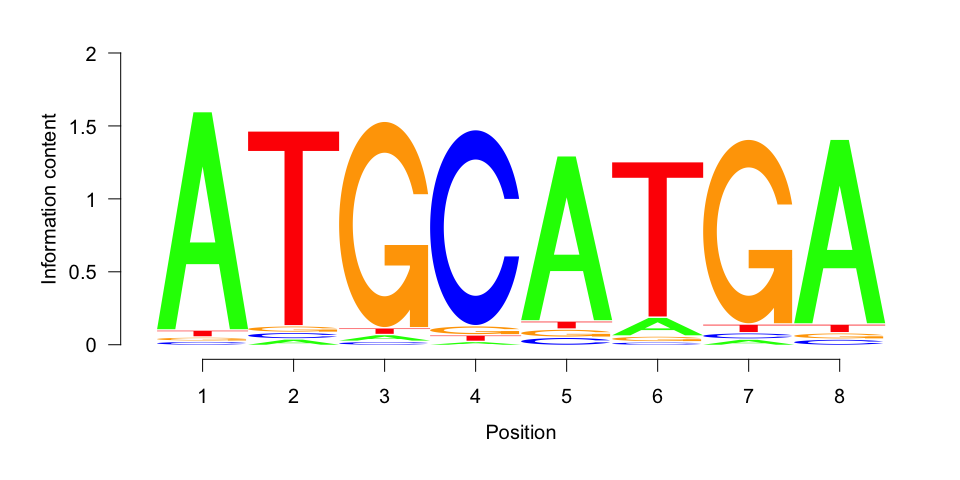
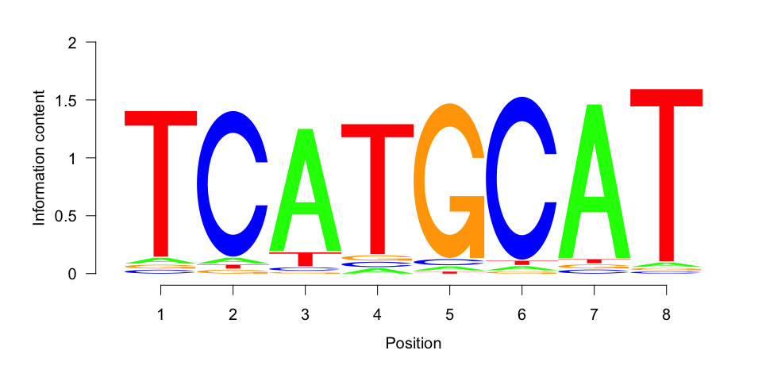

MotifFinder: Vignette (Tutorial)
================
Daniel Wells
2017-12-12

Simulate Data
-------------

We create 300 DNA sequences of length 200 with the motif "ATGCATGA" at the center of 20% of the sequences.

``` r
library(MotifFinder)
set.seed(42)
simulated_sequences <- simulate_sequences(motif="ATGCATGA")

str(simulated_sequences)
```

    ##  chr [1:300] "CCTCGGGAGGTGCTTCCATGCACCAGTCTCGCTGACAACGTTACTCCGCGTTTCAGGATGGCCGCATCGAAAATAGATGAGATGCGAAATGAACCGTGGGATGCATGAGAG"| __truncated__ ...

Run MotifFinder
===============

We run MotifFinder with a length slightly shorter than the known motif length.

``` r
motif_found <- findamotif(simulated_sequences, len=7)
```

Plot the Motif(s) Found
-----------------------

We can see that we have recovered the motif.

``` r
library(ggseqlogo)
ggseqlogo(get_PWM(motif_found))
```



``` r
ggseqlogo(get_PWM(motif_found, complement=TRUE))
```


