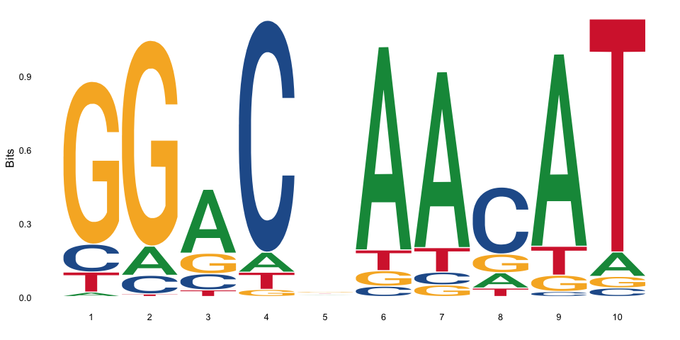
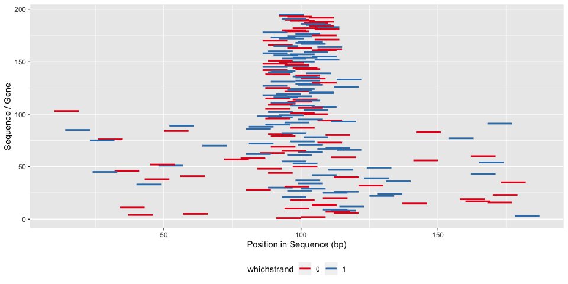
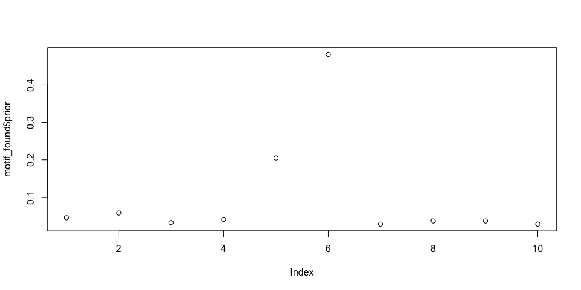
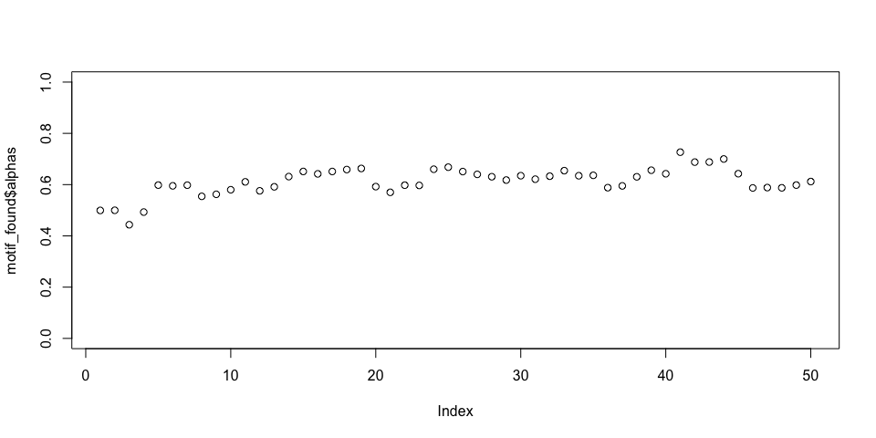

MotifFinder: Vignette (Tutorial)
================
Daniel Wells
2019-02-18

## Simulate Data

We create 300 DNA sequences of length 200 with the motif “ATgTT\_GtCC”
around the center of 50% of the sequences.

``` r
library(MotifFinder)
set.seed(42)
simulated_sequences <- simulate_sequences(motif="ATgTT_GtCC")

str(simulated_sequences)
```

    ##  Named chr [1:300] "CCTCGGGAGGTGCTTCCATGCACCAGTCTCGCTGACAACGTTACTCCGCGTTTCAGGATGGCCGCATCGAAAATAGATGAGATGCGAAATGAAATTTTTGTAATCCGGGAG"| __truncated__ ...
    ##  - attr(*, "names")= chr [1:300] "1" "2" "3" "4" ...

# Run MotifFinder

We run MotifFinder with a length slightly shorter than the known motif
length.

``` r
motif_found <- findamotif(simulated_sequences, len=7)
```

## Plot the Motif(s) Found

We can see that we have recovered the motif.

``` r
library(ggseqlogo)
ggseqlogo(get_PWM(motif_found))
```

<!-- -->

``` r
ggseqlogo(get_PWM(motif_found, complement=TRUE))
```

<!-- -->

## Where is the motif

We can also check the location of the motifs found as well as the
location it thinks the motifs are.

``` r
plot_motif_location(motif_found)
```

<!-- -->

``` r
plot(motif_found$prior)
```

<!-- -->

## Check Convergence

It’s a good idea to plot the inferred probability the motif being in
each sequence (alpha parameter) for each iteration to check convergence.

``` r
plot(motif_found$alphas, ylim=c(0,1))
```

<!-- -->

Other helper functions include downloading PWMs from the Jaspar or
Hocomoco databases.

``` r
Ascl2 <- download_PWM("MA0816.1")
str(Ascl2)
```

    ## List of 2
    ##  $ pwm : num [1:10, 1:4] 0.6469 0.3663 0.0267 0.9046 0.0346 ...
    ##   ..- attr(*, "dimnames")=List of 2
    ##   .. ..$ : NULL
    ##   .. ..$ : chr [1:4] "A" "C" "G" "T"
    ##  $ name: chr "Ascl2"

## Extracting DNA from the genome

To use real DNA instead of simulating sequences you will need to
download the genome and extract regions that are specified using a BED
file.

``` bash
wget ftp://ftp.ensembl.org/pub/release-95/fasta/homo_sapiens/dna/Homo_sapiens.GRCh38.dna_sm.primary_assembly.fa.gz
gunzip motifs/Homo_sapiens.GRCh38.dna_sm.primary_assembly.fa.gz
samtools faidx motifs/Homo_sapiens.GRCh38.dna_sm.primary_assembly.fa

bedtools getfasta -s -fi Homo_sapiens.GRCh38.dna_sm.primary_assembly.fa -bed example_locations.bed -name > example_locations.fasta
```

We can then load these sequences using the helper function
load\_sequences

``` r
genomic_sequences <- load_sequences("example_locations.fasta")
```
