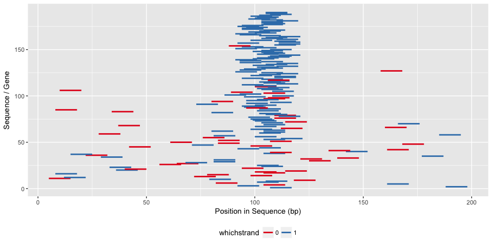
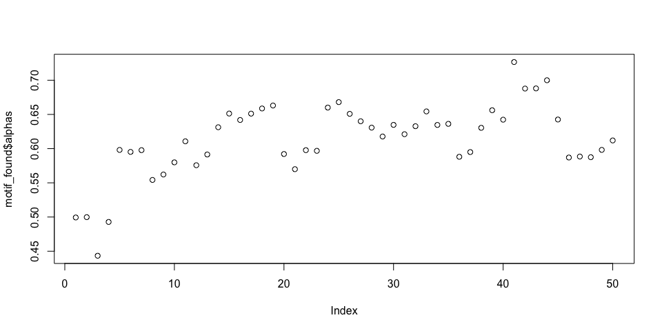

MotifFinder: Vignette (Tutorial)
================
Daniel Wells
2018-02-02

Simulate Data
-------------

We create 300 DNA sequences of length 200 with the motif "ATgTT\_GtCC" around the center of 50% of the sequences.

``` r
library(MotifFinder)
set.seed(42)
simulated_sequences <- simulate_sequences(motif="ATgTT_GtCC")

str(simulated_sequences)
```

    ##  Named chr [1:300] "CCTCGGGAGGTGCTTCCATGCACCAGTCTCGCTGACAACGTTACTCCGCGTTTCAGGATGGCCGCATCGAAAATAGATGAGATGCGAAATGAAATTTTTGTAATCCGGGAG"| __truncated__ ...
    ##  - attr(*, "names")= chr [1:300] "1" "2" "3" "4" ...

Run MotifFinder
===============

We run MotifFinder with a length slightly shorter than the known motif length.

``` r
motif_found <- findamotif(simulated_sequences, len=7)
```

Plot the Motif(s) Found
-----------------------

We can see that we have recovered the motif.

``` r
library(ggseqlogo)
ggseqlogo(get_PWM(motif_found))
```


``` r
ggseqlogo(get_PWM(motif_found, complement=TRUE))
```


Where is the motif
------------------

We can also check the location of the motif found.

``` r
plot_motif_location(motif_found)
```



Check Convergence
-----------------

It's a good idea to plot the inferred probability the motif being in each sequence (alpha parameter) for each iteration to check convergence.

``` r
plot(motif_found$alphas)
```



Other helper functions include downloading PWMs from the Jaspar or Hocomoco databases.

``` r
Ascl2 <- download_PWM("MA0816.1")
```

    ## Warning in fread(paste0("http://jaspar.genereg.net/api/v1/matrix/", id, :
    ## Starting data input on line 2 and discarding line 1 because it has too few
    ## or too many items to be column names or data: >MA0816.1 Ascl2

``` r
str(Ascl2)
```

    ##  num [1:10, 1:4] 0.6505 0.3614 0.0235 0.9414 0.037 ...
    ##  - attr(*, "dimnames")=List of 2
    ##   ..$ : chr [1:10] "V1" "V2" "V3" "V4" ...
    ##   ..$ : chr [1:4] "A" "C" "G" "T"
